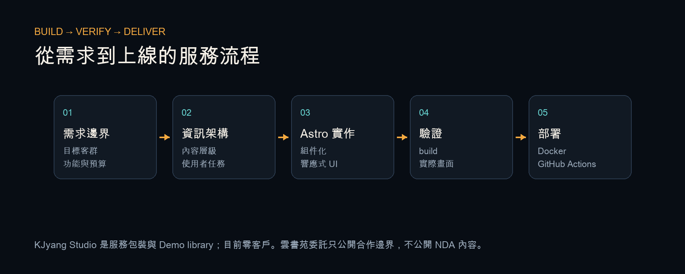

# KJyang Website / Studio

**為快速理解 KJyang 作品、方法與服務邊界的訪客，這個 Astro 網站整合個人作品集、KJyang Studio、Demo library 與靜態產品頁。**

> Live portfolio and service-positioning site built with Astro, structured content, Docker, and a verified deployment workflow.

- Live：[kjyang0114.dev](https://kjyang0114.dev/)
- Studio：[kjyang0114.dev/studio](https://kjyang0114.dev/studio/)

| 個人首頁 | KJyang Studio |
|---|---|
|  |  |

## 這個專案證明什麼

- 個人網站是公開作品入口與學習軌跡。
- 2025 年，雲書苑教育科技有限公司負責人由早期個人網站主動聯絡。
- 該合作約在 2025 年 8–12 月；技術服務款 NT$40,000，工具代墊 NT$2,694，收款證明合計 NT$42,694。
- **NDA 邊界**：只公開公司名稱、合作起點、時間、款項結構與保密流程；不公開專案名稱、功能、程式碼、架構與畫面。
- **KJyang Studio 目前零客戶。** Studio 是服務定位、價格邊界與 Demo library，不暗示舊委託由 Studio 成交。

## 架構與交付



```text
src/pages/                 個人網站、作品、靜態產品頁
src/pages/studio/          Studio 服務、價格、流程、Demo、insights
src/data/                  服務、案例、SEO、trust 的結構化內容
src/components/            共用 navigation、shell、footer、notice
public/                    brand、Demo 與 Web Highlighter Pro 靜態素材
.github/workflows/         build、SSH sync、Docker rebuild
```

PR98 本次重新執行 `npm ci && npm run build`，成功建置 **54 條路由**。

## 核心程式

| 服務邊界資料化 | Build 與部署檢查 |
|---|---|
|  |  |

## 技術決策，與我學到的事

1. **內容不應散在 page template。** 服務、價格、process 與 trust evidence 放進 `src/data`，讓中英文、SEO 與 UI 共用同一資料邊界。
2. **Demo 必須明確標記。** 展示頁是介面與資訊架構演示，不能被誤認為真實客戶案例。
3. **上線不只是上傳檔案。** Workflow 先 build，再驗證 host/user/path，排除無關檔案，最後才在 Mac mini 重建 Docker container。
4. **網站數據也要與申請文件同口徑。** 本次移除 repo 數量宣傳、不適合申請主軸的案例與無法由 Git 歷史支持的貢獻敘事，並把年級統一為高三。

## 本機執行

```bash
npm ci
npm run dev
npm run build
npm run preview
```

Docker：

```bash
docker compose up --build
```

## 狀態與限制

- 個人網站：上線。
- Studio：市場測試與服務包裝；零客戶。
- Web Highlighter Pro：local-first 產品原型；尚未商業化。
- 不宣稱：SEO 排名、GEO 引用、詢問轉換率或 Studio 成交量。
