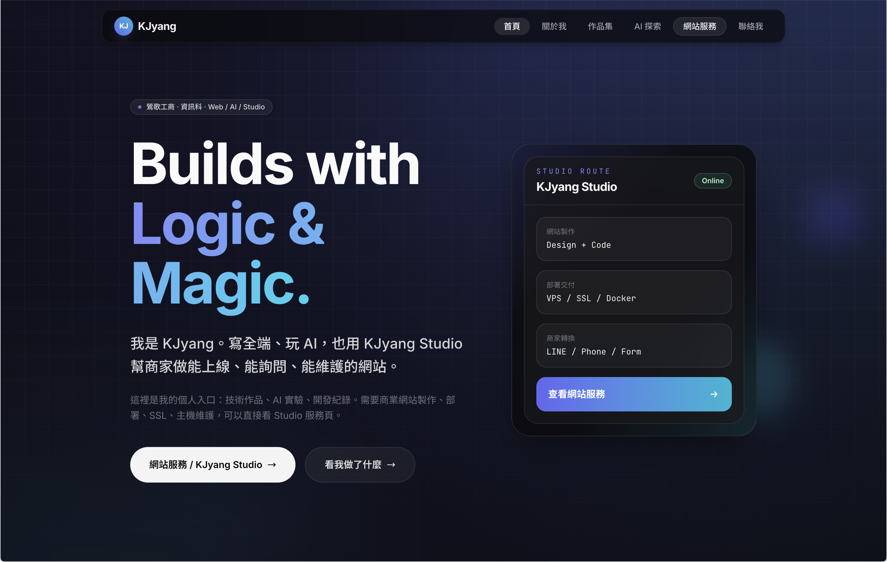
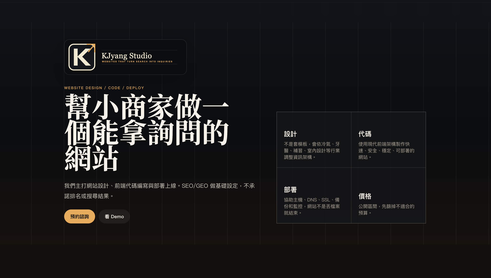
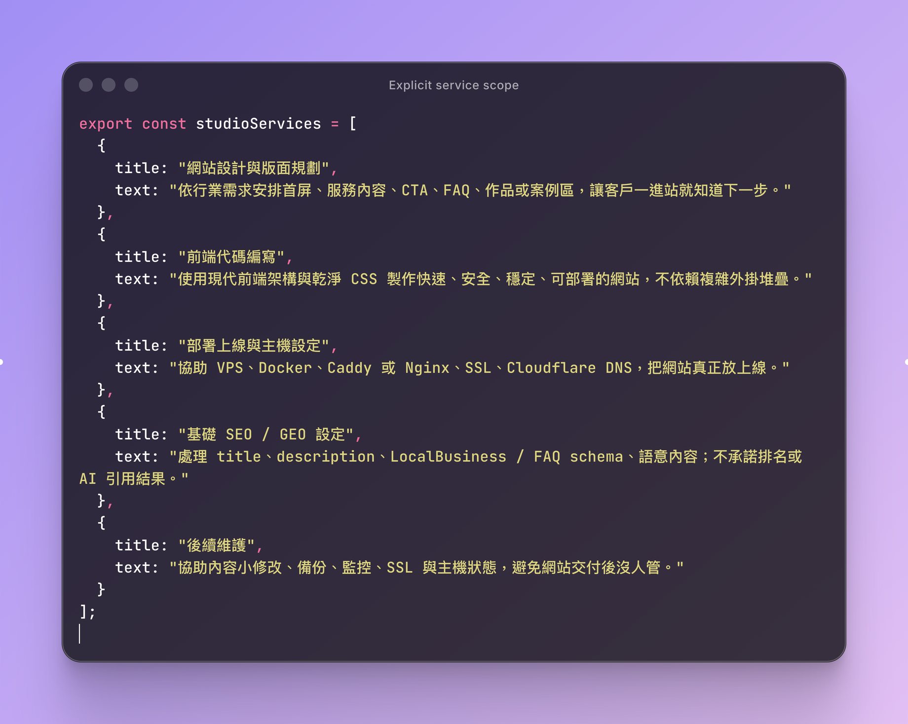
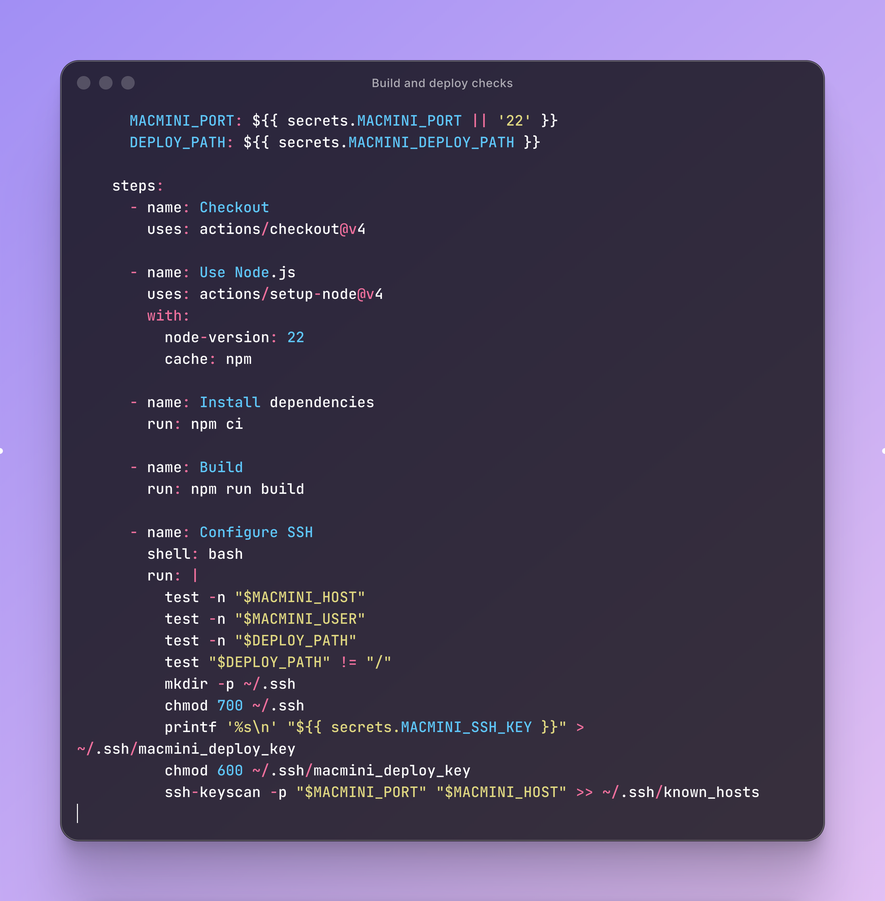

# KJyang Website / Studio

以 Astro 建立的個人網站，整合作品導覽、學習紀錄、網站服務頁與互動 Demo。

- Website：[kjyang0114.dev](https://kjyang0114.dev/)
- Studio：[kjyang0114.dev/studio](https://kjyang0114.dev/studio/)

| 個人首頁 | Studio |
|---|---|
|  |  |

## 主要功能

- 多頁作品集與專案內容。
- 中英文內容與 SEO metadata。
- Studio 服務頁、流程說明、FAQ 與 Demo library。
- Astro 靜態建置與 responsive layout。
- GitHub Actions、Docker 與自架主機部署流程。

## 專案結構

```text
src/pages/           網站路由
src/pages/studio/    Studio 頁面與 Demo
src/data/            服務、案例與 SEO 結構化內容
src/components/      Navigation、layout、footer 與共用元件
public/              品牌、圖片與靜態產品檔案
.github/workflows/   Build 與部署流程
```

## 核心程式

| 結構化內容 | Build 與部署檢查 |
|---|---|
|  |  |

## 實作重點

### 內容資料化

服務、流程、FAQ 與頁面 metadata 放在 `src/data`，避免相同資訊散落在多個 template，也讓不同頁面共用一致資料。

### 元件與版型

Navigation、shell、section、card 與 footer 使用共用 components。頁面保留自己的內容結構，不重複處理基礎 layout。

### 部署流程

GitHub Actions 先安裝依賴並執行 build，再檢查部署環境變數，透過 SSH 同步輸出並重建 Docker container。

## 本機執行

```bash
npm ci
npm run dev
npm run build
npm run preview
```

Docker：

```bash
docker compose up --build
```

## 限制

- 部署需要主機、DNS、TLS 與 SSH secrets。
- Demo library 用於展示介面與操作流程，不連接正式客戶資料。
- SEO 與流量成效需要另外接上分析工具後量測。


## 個人網站重新設計（2026-09）

個人站採用 Human, then Code 視覺方向，淺深色自動跟隨系統。
Studio、產業 Demo、產品頁與既有遊戲功能維持原版。

- `/`：個人定位、代表作品互動、網站服務入口。
- `/projects`：8 個作品的領域／語言篩選與可展開索引。
- `/projects/[slug]`：作品問題、實作、資料流程、目前範圍、GitHub。
- `/about`：學習與交付經歷、開發觀點、個人興趣。
- `/ai`：7 個 AI 入門主題與延伸閱讀。
- `/contact`：個人交流管道與 Studio 服務入口。

主要內容集中在 `src/data/projects.ts`，樣式位於 `src/styles/design-system.css`、`portfolio.css` 與 `exhibits.css`。
個人站元件放在 `src/components/portfolio/`，不與原 Studio 的外觀元件共用。
Three.js 模組於線稿接近可視範圍時載入；支援系統減少動態、暫停、離屏停止與 WebGL 失敗時的 SVG 替代。
2048 互動僅示範合併規則，不執行訓練模型。

```sh
npm ci
npm run dev -- --host 127.0.0.1 --port 4321
npm run verify:site
```

`verify:site` 先 build，再檢查個人站路由、連結、資產、metadata、作品與 AI 主題完整性及 sitemap。
舊設計提案存放於專案外的 `../design-archive/approved-proposals/`，不隨網站發布。
部署由 `main` 分支的 GitHub Actions 執行，通過建置後同步至 Mac mini 並重建 Docker container。

### Resume and motion

- `/resume`: complete engineering resume, section navigation, system appearance, and print / save-as-PDF stylesheet. Content lives in `src/data/resume.ts` and `src/pages/resume.astro`.
- Geometric art uses Three.js with an animated SVG fallback when WebGL cannot initialize. Both support pause, reduced-motion preferences, pointer response, and offscreen suspension.
- `npm run verify:motion` checks fallback animation and lifecycle without opening a browser. `npm run verify:site` builds and checks personal pages, including resume content and links.
